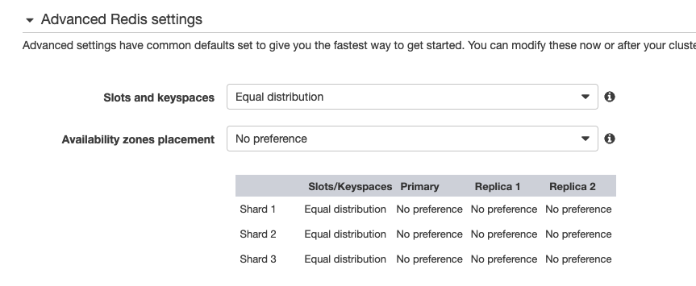
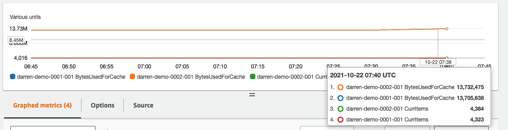
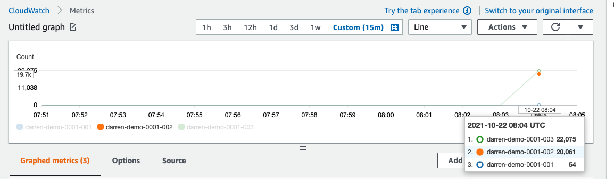

# stackexchange-redis-test

## Summary

This is a proof of concept to demostrate that you can run StackExchange.Redis .NET Core to connecting to Amazon ElastiCache. Also, the StackExchange.Redis .NET client  
- supports Redis Cluster Mode Enabled.
- supports reading data from Read Replicaas.
- supports data types such as String, Hashes, Lists, Set, SortSet

## Architecture

We are going to run clients on EC2. Since .NET is cross-platform, it is possible to run the app on both Linux instance/containers as well as Windows instances. In the diagram, I build 2 shards and 3 nodes per shard (1 primary and 2 replicas). It can also be scaled out/in online.


## Slot Keys 

According to the docs [4][5], it is mentioned that The base algorithm used to map keys to hash slots is the following (read the next paragraph for the hash tag exception to this rule):

HASH_SLOT = CRC16(key) mod 16384

It is also mentioned, "tests for CRC16 behaved remarkably well in distributing different kinds of keys evenly across the 16384 slots." 

Every node in a Redis Cluster is responsible for a subset of the hash slots, so for example you may have a cluster with 3 nodes, where:

Node A contains hash slots from 0 to 5500.
Node B contains hash slots from 5501 to 11000.
Node C contains hash slots from 11001 to 16383.

When creating an ElastiCache cluster, you can define the keyslot distribution - by default it is equal. 



There is an exception for the computation of the hash slot that is used in order to implement hash tags. Hash tags are a way to ensure that multiple keys are allocated in the same hash slot. This is used in order to implement multi-key operations in Redis Cluster. Refer to the cluster spec [4] for details. 

## How to run this program 

As regular .NET project, you can run `dotnet restore` to build the project, and `dotnet run` to run the app. 

When you run this program, fill the environment variable `REDIS_ENDPOINT` with Amazon ElastiCache Cluster Endpoint. For example, set the environment variable `REDIS_ENDPOINT` with value `darren-demo.lm5w0w.clustercfg.usw2.cache.amazonaws.com:6379`. 

You would also to make sure the connection are between the redis client and ElastiCache node are not blocked. Check the security groups of your client and server to ensure connection to redis server 6379 is not blocked.  

Dockerfile, Docker Compose files and Kubernetes manifests are located in the ./deploy folder if you would like to run it in Kubernetes or Amazon ECS or EKS. 

## 1. Use Lazy Class and long connection

The Lazy<T> object ensures that all threads use the same instance of the lazily initialized object and discards the instances that are not used. Thus, the cost of reducing the locking overhead is that your program might sometimes create and discard extra copies of an expensive object. [1][2]

According to the docs [7], StackExchange.Redis use Multiplexers instead of connection pool. Hence is it very important to ensure to **avoid opening a new connection to ElastiCache node for a single query**. Instead, use a long connection. Using a new connection for a single Redis query is expensive for both the client and server.

Monitor the `NewConnections` metric of your ElastiCache cluster to ensure that your client does not open a new connection for every single query.

## 2. Supporting Cluster Mode

The following code section generates random GUID and random place holder texts and write them into a Redis Cluster. 

```
            for (int i = 0; i < 100; i++)
            {
                string GUID = Guid.NewGuid().ToString();
                cache.StringSet(GUID, LoremIpsum(20, 40, 2, 3, 1));
                Console.WriteLine("Key: " + GUID + ", Value: " + cache.StringGet(GUID).ToString());
            }
```

The example output below when running the program:

```
...
Key: 3a94283b-49e8-4481-94e5-b75eeb0caa89, Value: ---erat magna euismod tincidunt euismod adipiscing elit adipiscing aliquam magna diam erat ut sed nibh tincidunt aliquam ut erat magna adipiscing sed dolor aliquam diam aliquam nibh dolore. tincidunt consectetuer euismod nonummy lorem diam ut nonummy adipiscing dolor tincidunt dolor consectetuer consectetuer dolore sit sed nibh ipsum amet nonummy nibh tincidunt erat ut elit lorem nonummy. laoreet ut amet ut laoreet nibh euismod tincidunt consectetuer aliquam aliquam consectetuer ut lorem adipiscing laoreet lorem dolore nibh ipsum nibh aliquam diam magna dolore adipiscing consectetuer dolor. ---
...
```

Running the redis cli to verify the query. There are two master nodes and two replica nodes. Only sending queries to the correct node will get a valid response, or the client will get a response saying it is in the wrong node `MOVED 4529 172.31.12.247:6379`. 

```
➜  git:(main) ✗ redis-cli -h $REDIS_ENDPOINT CLUSTER NODES

f563001ebaf7635839b8589d3096f85f746386ca 172.31.9.246:6379@1122 slave 99548c9ddaf8b0615db74af2e0b2005302e6e963 0 1634888345377 1620 connected
358fe18cbfdd88983651525758d5dbd1235bbba9 172.31.41.207:6379@1122 slave 0007db69c2ad65eaf33e5f7e4bad28d1d2b3df37 0 1634888346380 1619 connected
0007db69c2ad65eaf33e5f7e4bad28d1d2b3df37 172.31.12.247:6379@1122 myself,master - 0 1634888346000 1619 connected 0-3084 3563-3928 4314-5461 5513-5714 6254-6297 8285-8917 9529-9649 9884-10429 11131-11949 12569-13094 13778-14479
99548c9ddaf8b0615db74af2e0b2005302e6e963 172.31.40.201:6379@1122 master - 0 1634888347383 1620 connected 3085-3562 3929-4313 5462-5512 5715-6253 6298-8284 8918-9528 9650-9883 10430-11130 11950-12568 13095-13777 14480-16383

➜  git:(main) ✗ redis-cli -h 172.31.12.247 GET 3a94283b-49e8-4481-94e5-b75eeb0caa89

"---erat magna euismod tincidunt euismod adipiscing elit adipiscing aliquam magna diam erat ut sed nibh tincidunt aliquam ut erat magna adipiscing sed dolor aliquam diam aliquam nibh dolore. tincidunt consectetuer euismod nonummy lorem diam ut nonummy adipiscing dolor tincidunt dolor consectetuer consectetuer dolore sit sed nibh ipsum amet nonummy nibh tincidunt erat ut elit lorem nonummy. laoreet ut amet ut laoreet nibh euismod tincidunt consectetuer aliquam aliquam consectetuer ut lorem adipiscing laoreet lorem dolore nibh ipsum nibh aliquam diam magna dolore adipiscing consectetuer dolor. ---"
➜  git:(main) ✗ redis-cli -h 172.31.40.201 GET 3a94283b-49e8-4481-94e5-b75eeb0caa89

(error) MOVED 4529 172.31.12.247:6379
```

Checking the CloudWatch metrics of the ElastiCache cluster, and take a look at `BytesUsedForCache` and `CurrItems`, you will find that the keys are approximately uniform/even in 2 shards.  



## 3. Supporting Data Types

In the example program, we used these data typess: String, SortSet, Hash, Set, List. We also use increment and decrement for string keys. Examples are in the `Program.cs` source and you can find the related parts by referring the comments in the code. The use cases of these type datas are various and 

- String: any typical key/value pair and you can also serialize an object or a JSON and store as a string. 
- SortedSet: Leader boards, such as most popular items in a e-commerce shop or players with highest scores.  
- Hash: Maps composed of fields associated with values. For example, caching running a SQL query and store and store the result of multiple fields from the database row.  
- Sets – an unordered collection of strings with the ability to intersect, union, and diff other Set types. Find the blog [8] for an example.
- List: Remember more recent items that users view in a online retail shop; or communication between processes, using a consumer-producer pattern where the producer pushes items into a list, and a consumer (usually a worker) consumes those items and executed actions. 

The example output is below: 
```
iphone:13:256G 400
iphone:13:128G 200
iphone:13:256G:plus 100
name : Darren Lin
birthday : 2000/1/1
address : Taipei City

Green
Red
Blue

Orange
Banana
Apple
Orange
Banana
Apple
Orange
Banana
Apple
Orange

```

## 4. Supporting read from Replicas Nodes

In the code section below, the redis client is reading the same key `"Message"`. By specifying the `CommandFlags.PreferReplica`, the client will prefer to read data from replica nodes if possible.  

```
            for (int i = 0; i < 500000; i++)
            {
                cache.StringGet("Message", CommandFlags.PreferReplica);
                // Thread.Sleep(1000);
                if (i % 10 == 0) Console.WriteLine("Reading Message from Redis...");
            }
```

According to the source [8], the redis client is expected to use multiple replica nodes with a round-robin fashion.

```
        internal uint NextReplicaOffset() // used to round-robin between multiple replicas
            => (uint)System.Threading.Interlocked.Increment(ref _nextReplicaOffset);

```

We can further verify it by checking the CloudWatch metric `GetTypeCmds`.



In the screenshot above, the 0003 and 0002 are replica nodes and 0001 is primary nodes. You can see that the client is able to read data from replica nodes.  

## 5. MSET/MGET Operations 

Redis Cluster supports multiple key operations as long as all the keys involved into a single command execution (or whole transaction, or Lua script execution) all belong to the same hash slot. 

However, it is not possible to do MGET/MSET for keys in different slots. Redis server will reply `error` and the .NET Redis Client will throw an exception. 

```
# Trying to do MGET MSET...
# Sending the message to the Redis Server will return "(error) CROSSSLOT Keys in request don't hash to the same slot"

darren-demo.lm5w0w.clustercfg.usw2.cache.amazonaws.com:6379> MSET a b c d
(error) CROSSSLOT Keys in request don't hash to the same slot
```

## 6. Metrics to Monitor

[] Metrics for Redis - https://docs.aws.amazon.com/AmazonElastiCache/latest/red-ug/CacheMetrics.Redis.html
[] Which Metrics Should I Monitor? - https://docs.aws.amazon.com/AmazonElastiCache/latest/red-ug/CacheMetrics.WhichShouldIMonitor.html

The following CloudWatch metrics offer good insight into ElastiCache performance. In most cases, we recommend that you set CloudWatch alarms for these metrics so that you can take corrective action before performance issues occur.

- CPUUtilization
- EngineCPUUtilization
- SwapUsage
- Evictions
- CurrConnections
- Memory
- Network
- Latency
- Replication

## 7. Scaling

- If the nodes in your cluster are under memory pressure, you might decide to scale out so that you have more resources to better store data and serve requests. You can determine whether your nodes are under memory pressure by monitoring the following metrics: FreeableMemory, SwapUsage, and BytesUseForCache. [9]
- Also, If latency/throughput issues are plaguing your cluster, you might need to scale out to resolve the issues. You can monitor your latency and throughput levels by monitoring the following metrics: CPUUtilization, NetworkBytesIn, NetworkBytesOut, CurrConnections, and NewConnections.
- ElastiCache for Redis 6.0+ and Large, XLarge, 2XLarge supports Auto Scaling. ElastiCache for Redis supports scaling for Shards and Replicas. [10]

## 8. Multiple Clients

If `STRESS_MODE` environment variable being `true`, the progam will run in stress mode to write data to ElastiCache.

- Run 10 clients, you can scale out ElastiCache cluster online. 
- The request per minute per node can reach 170,000. 
- Scaling out the ElastiCache cluster takes time. If the speed of data growth too fast, you will still get OOM error even after you scale out.   

```
for (int i = 0; i < 100; i++) WriteDataToRedis(500000);
for (int i = 0; i < 10000; i++) await WriteDataToRedisAysnc(30);
```

## 9. Async Programming

StackExchange.Redis supports asynchronous API, so that you can take advantage of multi-threading instead of managing threads and locks on your own. The method `WriteDataToRedisAysnc` showed how to do async programming using `StringSetAsync` method and `WhenAll` method to continue when all of the write tasks are completed.

## 10. Fire and Forget 

The fire-and-forget usage is accessed by the optional CommandFlags flags parameter on all methods (defaults to none). In this usage, the method returns the default value immediately.

A typical use-case of this might be to increment page-view counts.

## 11. ElastiCache for Redis Cluster Mode Enabled

You can refer to the AWS CDK in /cdk to create ElastiCache Redis Cluster. 

## Future Works

[ ] - Record and latency to ElastiCache cluster and export them as Prometheus metrics 
[ ] - IaC code to launch ElastiCache cluster, and ElasticBeanstalk EC2 clients.

## References

1. Lazy Initialization - https://docs.microsoft.com/en-us/dotnet/framework/performance/lazy-initialization
2. https://docs.microsoft.com/en-us/dotnet/api/system.lazy-1?view=net-5.0
3. [Redis] C# 存取 Redis - 使用 StackExchange.Redis https://marcus116.blogspot.com/2019/02/redis-c-redis-stackexchangeredis.html
4. Redis Cluster Specification - https://redis.io/topics/cluster-spec
5. Redis cluster tutorial - https://redis.io/topics/cluster-tutorial
6. Pipelines and Multiplexers - https://stackexchange.github.io/StackExchange.Redis/PipelinesMultiplexers
7. https://github.com/StackExchange/StackExchange.Redis/blob/f0e485daa85e5bc2dfc1ff7eebb77c4d6a072696/src/StackExchange.Redis/ServerEndPoint.cs#L381
8. https://medium.com/analytics-vidhya/the-most-important-redis-data-structures-you-must-understand-2e95b5cf2bce
9.
10. Auto Scaling ElastiCache for Redis clusters - https://docs.aws.amazon.com/AmazonElastiCache/latest/red-ug/AutoScaling.html
